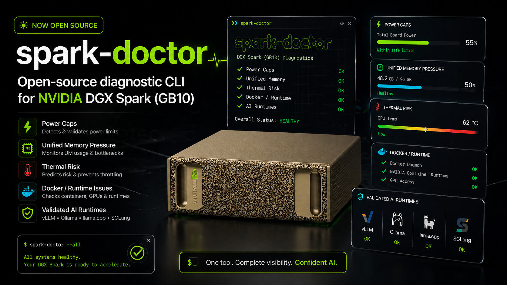

# Spark Doctor

Local diagnostic CLI for NVIDIA DGX Spark. Collects system, GPU, memory, Docker, runtime, network, and recipe data, applies DGX Spark-specific rules, and prints a short answer: **what is wrong, why, and what to try next.**

Read-only. No dashboard. No auto-fixes. No telemetry.

<p align="center">
  
</p>

## Why

DGX Spark is a new platform. When something goes wrong, the signal is scattered across `nvidia-smi`, `/proc/pressure/*`, `dmesg`, `docker info`, backend logs, forum threads, and Field Diagnostics. Owners hit the same issues repeatedly — GPU stuck in a 14 W low-power state, unified memory pressure stalling inference, thermal shutdowns, Docker runtime not registered, recipes with `tensor_parallel_size` set for a multi-GPU box.

Spark Doctor collects those signals in one command, applies DGX Spark-specific rules, and tells you the likely cause and the next step — in plain English, with the evidence attached.

## Install

```bash
git clone https://github.com/joeynyc/spark-doctor.git && cd spark-doctor
python3 -m venv .venv && source .venv/bin/activate
pip install -e .
```

Requires Python 3.11+.

### Shell completion

```bash
spark-doctor --install-completion   # bash, zsh, fish, or PowerShell
```

Restart your shell afterwards. Use `--show-completion` to print the script instead of installing it.

## Commands

```bash
spark-doctor scan                              # full scan + diagnosis
spark-doctor scan --json scan.json --markdown report.md
spark-doctor scan --python /path/to/workload/.venv/bin/python
spark-doctor doctor --from scan.json           # re-run rules on saved scan
spark-doctor report --from scan.json --format {markdown,forum,github}
spark-doctor recipe check recipe.yaml
spark-doctor anonymize scan.json --out redacted.json
spark-doctor self-test
spark-doctor version
```

Exit codes for `scan` and `doctor`: `0` clean · `1` warning · `2` critical · `3` incomplete diagnosis (collector or rule failure). Incomplete diagnosis takes precedence over finding severity; existing warning/critical findings remain visible. Exporting a report succeeds with `0` even if the saved diagnosis is incomplete; the exported report retains that status.

CUDA/package checks inspect `python3` on PATH unless you select a workload interpreter with `--python`. Reports identify the selected environment; a scan does not inspect other virtual environments or container Python installations automatically. If PyTorch cannot be imported there, its CUDA compatibility has not been assessed.

An explicitly CPU-tagged PyTorch build with no CUDA support produces a warning for the selected interpreter. This does not establish whether a separate GPU container or another environment is working; an intentionally CPU-only host environment can ignore the warning.

## What it detects

| ID | Detects |
|---|---|
| `power.low_draw_under_load` | High GPU utilization with suspiciously low power draw (e.g. 14 W cap). Downgraded to info when the GPU clock is normal, since memory-bound decode draws little power at boost clock. |
| `thermal.shutdown_risk` | GPU temp ≥ 85/90 C or thermal events in logs. |
| `memory.uma_pressure` | Low `MemAvailable`, high memory PSI, or heavy swap use. |
| `runtime.docker_unhealthy` | Docker/NVIDIA container runtime missing or misconfigured. |
| `backend.multiple_heavy_models` | Two or more heavy model backends running concurrently. |
| `cuda.torch_cu12_wheel` | PyTorch built for CUDA 12 on a CUDA 13 / GB10 system. |
| `cuda.libcudart_missing` | Package linked against a CUDA runtime (`libcudart.so.N`) that is not installed. |
| `cuda.sm121_not_in_arch_list` | PyTorch build ships no SM_121 kernels for GB10. |
| `cuda.nvcc_toolkit_mismatch` | `nvcc` on PATH is older than the driver's CUDA version. |
| `backend.kv_cache_oom` | vLLM "No available memory for the cache blocks" — CUDA-graph memory squeezed out the KV cache (fix: `--enforce-eager`), a distinct failure from host `memory.uma_pressure`. |
| `memory.oom_killer` | Kernel OOM killer fired this boot (critical), or a container hit its own memory limit (warning). |
| `gpu.xid_error` | `NVRM: Xid` GPU errors this boot; driver/hardware-class Xids are critical, application-class ones a warning. |
| `network.nic_link_below_1g` | An active interface with a known link speed below 1 Gb/s. |
| `backend.nemotron_v3_discards_primed_reasoning` | A vLLM 0.22.1 environment and a process using the `nemotron_v3` reasoning parser; prompt priming still needs manual verification. |
| `cuda.aarch64_prebuilt_wheel_gap` | Optional flash-attn or bitsandbytes imports fail or report a CPU-only build on aarch64 + GB10. |
| `cuda.torch_cpu_only` | The selected Python successfully imports an explicitly CPU-tagged PyTorch build with no CUDA support. |

Recipe validator checks tensor-parallel vs GPU count, container image registry, arm64 compatibility, memory budget, and aggressive `gpu_memory_utilization` / context lengths.

Recipe fields reject unknown keys and invalid numeric values. Tensor parallelism must fit the declared `nodes × gpus_per_node` capacity; single-node recipes also respect `--gpus`. Remote-node capacity is declared, not discovered. Available-memory and architecture checks require `--mem-available-gb` and `--arch`, respectively.

A critical low-power finding requires at least three consecutive qualifying samples. Missing readings, recovered readings, or timestamp gaps break the sequence. Transient readings prompt confirmation and resampling before power-cycle advice.

Recipes can also declare `runtime.command`, `runtime.quantization`, and an optional top-level `is_moe` override. For vLLM, `--enforce-eager` produces an informational memory/throughput tradeoff note. MXFP4 MoE recipes produce a compatibility warning, not an automatic failure: support depends on the vLLM build and MoE backend. See the [vLLM SM120/SM121 backend documentation](https://docs.vllm.ai/en/latest/features/quantization/b12x/).

Docker collection recognizes named NVIDIA runtimes, runtime hooks, and CDI evidence. The optional `nvidia-ctk cdi list` probe counts NVIDIA GPU device names; failed probes are recorded in collector notes. Optional GPU package imports run in a separate subprocess so a native crash cannot discard the core PyTorch probe results.

## Privacy

Reports are anonymized by default:

- Locally detected hostname/username and recognized home paths replaced; imported hostnames are inferred from `uname` when available.
- Private IPv4, IPv6 (including global, link-local, and scoped addresses), and MAC addresses redacted unless `--include-network-identifiers`.
- Hardware serial/UUID fields, English firmware serial-number/UUID lines, and NVIDIA GPU UUIDs redacted. Firmware probes use a per-process C locale for stable labels without changing system settings. Firmware model GUIDs and version numbers are preserved. `--include-network-identifiers` does not expose hardware identifiers; only `--include-sensitive-data` bypasses this protection on scans and exports.
- HF, NGC, OpenAI, bearer, JWT, and SSH-key patterns redacted.
- Credentials in process arguments (including `--api-key VALUE`) and structured secret fields redacted.
- Logs (`dmesg`, `journalctl`) are read locally so log-based checks can run, but raw log text is only included in reports with `--include-logs`. Findings may quote a redacted matching line as evidence. `--no-logs` skips reading logs entirely.

`doctor` and `report` reapply redaction to imported scans by default. `--include-network-identifiers` keeps network identifiers; `--include-sensitive-data` explicitly keeps raw data, including credentials, and replaces the old `scan --no-anonymize` option. Review any report before sharing: automatic redaction cannot recognize every possible secret.

Imported raw logs may still contain bare source usernames when the source identity is unknown, and older firmware captures with translated labels may retain identifiers. Review those captures before sharing.

## Safety

No package installs, driver updates, process kills, reboots, clock locking, or power changes. All fixes are instructions.

Docker checks only use local Unix sockets, including a configured rootless socket. A remote Docker host/context is recorded as an incomplete check and is never contacted.

## Development

```bash
pip install -e '.[dev]'
pytest
```

New rules go in `src/spark_doctor/rules/`, register in `rules/engine.py`, add a fixture in `tests/fixtures/`, add a test.

GitHub Actions runs the test suite and CLI self-test on Python 3.11–3.14. Collector regression tests use mocked command results and do not require GPU hardware or a Docker daemon.

## License

MIT.
